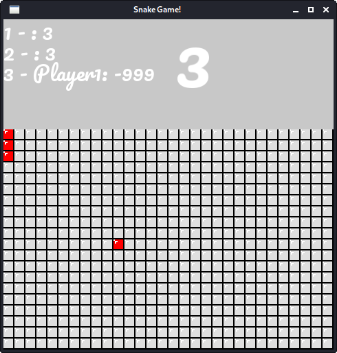

# Snake app
## Requirements
You need to have SFML installed.<br>
Install from [here](https://www.sfml-dev.org/tutorials/2.5/start-osx.php) if you are on macOS<br>
Instal from [here](https://www.sfml-dev.org/tutorials/2.5/start-linux.php) if you are on Linux<br>

## Instructions
Compile the game through simply running the make command
```
    make
```

Once the binary is compiled just run it and enjoy your game!
```
    bin/game
```
